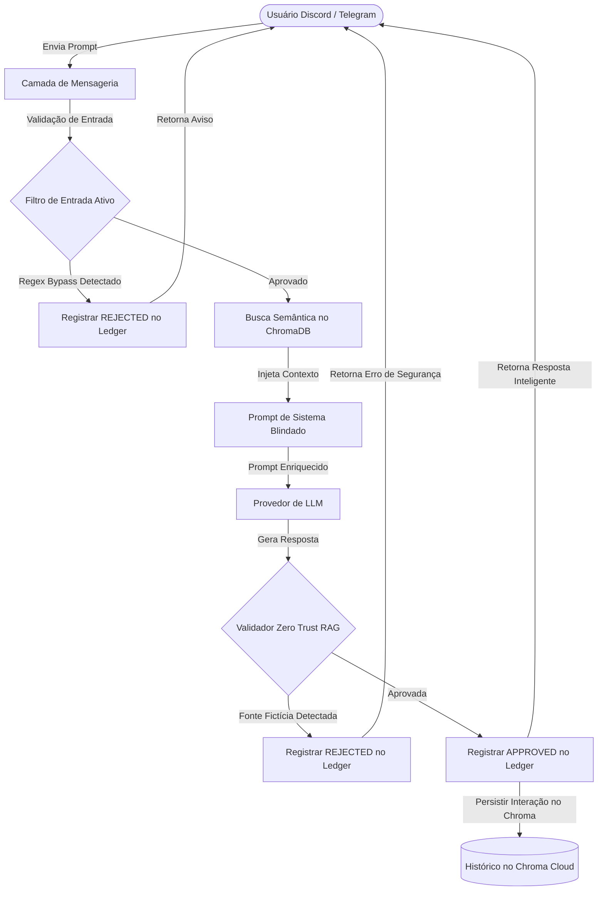
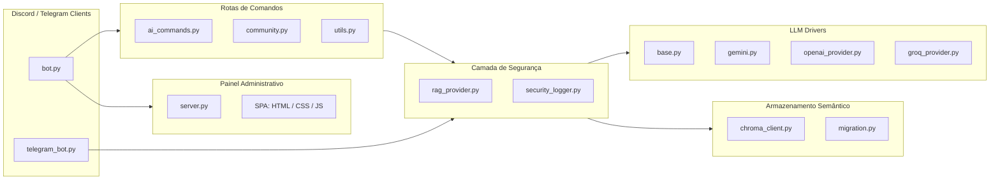

# Arquitetura do DSE.Assist (DSE Bot)

Este documento descreve a arquitetura técnica, o modelo de ameaças e as métricas de qualidade do **DSE.Assist**, o assistente oficial de Inteligência Artificial e dados da comunidade **Data Science Enthusiasts (DSE)**.

---

## 🗺️ Nível 1: Visão Executiva (Fluxo de Dados)

O diagrama abaixo ilustra o ciclo de vida de uma mensagem enviada por um usuário (seja no Discord ou no Telegram) até a entrega da resposta assistida por IA, passando pelas camadas de proteção ativa, busca semântica (RAG) e auditoria criptográfica.

---

## 📂 Nível 2: Visão Técnica (Componentes e Módulos)

O projeto é estruturado de forma desacoplada para permitir que colaboradores das squads consigam contribuir em componentes específicos sem quebrar o ecossistema principal.

### Detalhamento dos Componentes Chaves:
* **[bot.py](bot.py) / [telegram_bot.py](telegram_bot.py):** Pontos de entrada assíncronos que orquestram a conexão dos clientes de mensageria na mesma thread e loop de eventos.
* **[ai_providers/rag_provider.py](ai_providers/rag_provider.py):** Wrapper centralizador de segurança que implementa o padrão *Zero Trust RAG* e *Prompt Injection Prevention*.
* **[ai_providers/security_logger.py](ai_providers/security_logger.py):** Mecanismo de log imutável baseado em cadeia de hashes SHA-256 local.
* **[dashboard/server.py](dashboard/server.py):** API REST e servidor HTTP assíncrono que permite o Hot Reload das configurações do bot em tempo real.

---

## 🛡️ Threat Model (Modelo de Ameaças)

Mapeamento de riscos específicos de segurança cibernética em aplicações integradas a LLM e o status de suas mitigações no DSE.Assist:

| Código | Ameaça | Impacto | Mitigação no DSE.Assist | Status |
| :--- | :--- | :--- | :--- | :--- |
| **TH-01** | Prompt Injection Direto | Controle de instruções da IA pelo usuário. | Filtro de Entrada Ativo com heurísticas Regex refinadas interceptando palavras-chave de bypass de sistema. | **Implementado** |
| **TH-02** | Indirect Prompt Injection | Injeção de instruções maliciosas via dados recuperados do RAG. | Envelopamento estrito das entradas em tags XML semânticas e blindagem do System Prompt. | **Implementado** |
| **TH-03** | RAG Poisoning | Ingestão de documentos falsos/maliciosos no banco vetorial. | Validação de procedência de metadados durante a ingestão via `migration.py` e descarte de fontes sem autoria. | **Implementado** |
| **TH-04** | Alucinação de Fontes (Halucination) | IA inventa fontes de dados falsas ou cita arquivos confidenciais. | Validação de Saída (Zero Trust RAG) que compara fontes citadas com as fornecidas pelo RAG; bloqueio em caso de divergência. | **Implementado** |
| **TH-05** | Adulteração de Logs de Auditoria | Invasores editam logs locais para apagar rastros de ataques. | Cadeia de hashes SHA-256 (ledger criptográfico WORM) conectando cada registro ao anterior. | **Implementado** |
| **TH-06** | Exfiltração de Dados / Abuso | Bots realizando spam de requisições de IA gerando custos. | Camada de controle de *Rate Limit* individual por usuário temporizado em memória. | **Implementado** |
| **TH-07** | Bypass por Ofuscação | Envio de prompts maliciosos codificados em Base64, Hex ou Cifra. | Decodificação e sanitização ativa das entradas do usuário antes da verificação do filtro. | **Pendente** |
| **TH-08** | Ingestão Indireta Maliciosa | Invasor induz o bot a ler páginas web comprometidas. | Restrição de leitura automática de URLs externas (desabilitado por padrão). | **Implementado** |

---

## 📊 Métricas de Qualidade e Observabilidade

Para evoluirmos a aplicação baseados em dados reais, o projeto foca no acompanhamento e otimização dos seguintes KPIs:

### 1. Métricas do Mecanismo RAG (Retrieval)
* **Recall@K:** Fração de documentos relevantes recuperados pelo ChromaDB dentre os disponíveis.
* **Precision@K:** Fração de documentos úteis entre os top-K recuperados.
* **Context Similarity:** Média dos scores de similaridade vetorial dos chunks passados ao LLM (alvo $\ge 0.55$).
* **Chunk Hit Rate:** Percentual de buscas semânticas que retornam pelo menos um chunk relevante.

### 2. Métricas de Modelos LLM (Generation)
* **Time to Response (TTR):** Latência média de geração da resposta pelo provedor (alvo $\le 3.5\text{s}$).
* **Consumo de Tokens:** Volumetria de tokens de entrada e saída por comando (rastreamento de custos).
* **Cost per Request:** Custo estimado de processamento financeiro baseado nas tarifas dos provedores.

### 3. Métricas de Segurança (AppSec)
* **Blocked Prompts:** Número de mensagens interceptadas pelo filtro de Prompt Injection.
* **Taxa de Falsos Positivos:** Prompts legítimos bloqueados incorretamente pelo filtro de segurança.
* **Taxa de Falsos Negativos:** Prompts maliciosos que burlaram o filtro e alcançaram o LLM.

### 4. Métricas da Plataforma (Infraestrutura)
* **Uptime Geral:** Tempo contínuo de atividade da instância do bot.
* **Latência de Conexão:** Tempo de ping com os servidores do Discord/Telegram (alvo $\le 200\text{ms}$).
* **Error Rate:** Percentual de chamadas de API que resultaram em erros de rede ou timeouts.
